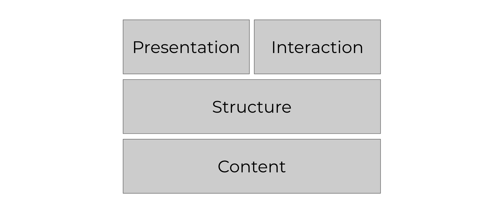
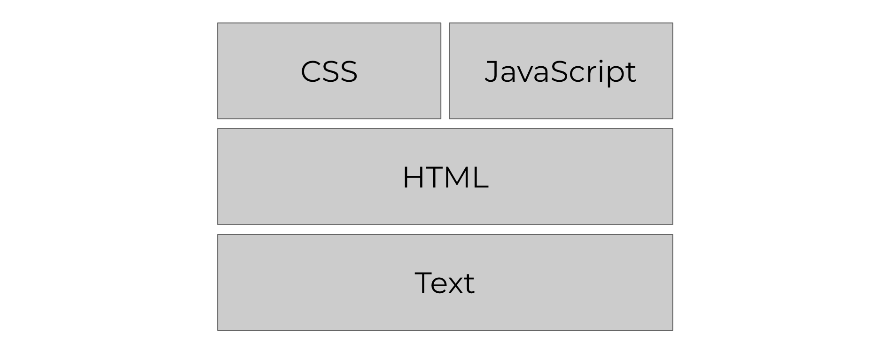

HTML, CSS, and JavaScript work hand in hand to create the web pages that we access and use almost daily. But how do these three separate technologies work together to do so?

Below is a basic structure of a web page. They can be thought of as building blocks.

**Content** is the main foundation of every web page. Without any **text, images, videos, audio, or basic content**, your website would not be conveying anything to the user visiting it. The very basic purpose of your website is to *provide information*. Your website aims to convey a message and make a statment to its visitors. Your purpose could be to sell a product, to serve as your portfolio, to promote your business, to serve as a place where other people can interact with one another, to let curious people search for something they don't know. Whatever reason it may be that you want to create a website, content is definitely an important thing to think about before starting.

Then after deciding on the content, you have to set up your website. You have to know how to organize it well, where each link goes, how each web page connects to the other parts of your site. You also have to decide on the hierarchy of information, which are headings, which are paragraphs, which are links, which are images, which are captions, etc. This is where **structure** comes in. Structure can be achieved using **HTML (HyperText Markup Language)**.

Then **presentation** and **interaction** block both sit on top of the structure for our building blocks. This means that one or the other is optional. You can choose to have interaction without presentation (or styling). You can also choose to have presentation without interaction. You can also have them both on your website (most websites usually have both).

After defining the structure of your web page, **presentation** will let you include styles on your site. This is where you can bring out the designer within you to define font families, decide on font sizes, set the background color of the site, define the size of images used to make them uniform, adjust the spacing between elements, align the text to center instead of to the left--any possible design you can think of can be done with the help of **CSS (Cascading Style Sheets)**. 

Meanwhile, **interaction** can give life to your website and improve the users' overall experience while viewing it. With interaction, you can change the content of your website or manipulate its design dynamically at a specified trigger. At a click of a button, you can show a popup containing more information. After 30 seconds, you can trigger a slight change in the background color. While the user types on a search bar, you can be displaying suggestions based on previous searches.

